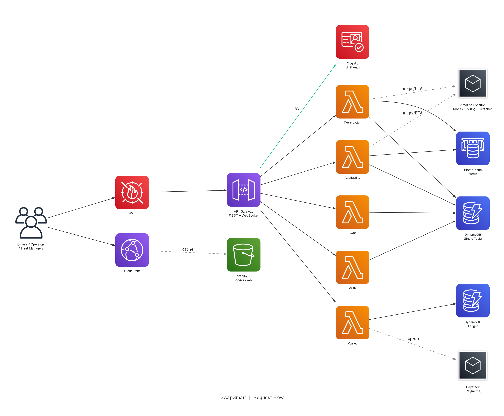
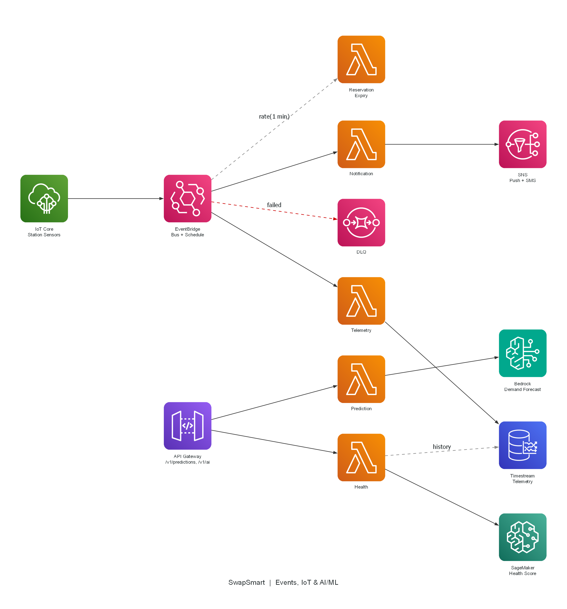
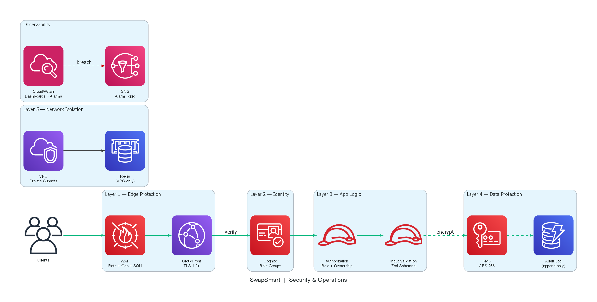

<h1 align="center">SwapSmart - AI-Powered Battery Swap Network</h1>

<p align="center">
  <strong>Intelligent coordination for Nigeria's electric mobility revolution</strong>
</p>

<p align="center">
  
  
  
  
  
</p>

<p align="center">
  <em>Built for the ONE WITH AI Hackathon (June 6, 2026) by Arthurite Integrated - AWS Advanced Tier Partner</em>
</p>

---

## The Problem

Every day, **3 million electric keke (tricycle) drivers** across Nigeria waste **30-60 minutes** searching for available battery swap stations. They arrive to find stations empty or with long queues, losing N5,000+ in daily earnings. Station operators over-stock or under-stock batteries because they can't predict demand. Fleet operators have zero visibility into battery health across their vehicles. This is a **data and coordination problem**, exactly what cloud + AI solves.

**SwapSmart** is the intelligent brain that connects EV drivers, battery swap station operators, and fleet managers through real-time data, AI-powered demand prediction, and smart routing, saving each driver up to N150,000/month in wasted time.


---


### Diagram 1 - Request Flow (synchronous path)

The primary data path from end-users through the edge layer, API, domain services, and into the data stores. Every request passes through WAF rate-limiting and CloudFront TLS termination before hitting API Gateway. Cognito validates JWTs, then routes to one of five domain Lambdas. Availability and Reservation services query ElastiCache Redis for sub-ms reads; all domain services persist to DynamoDB (single-table design). The Wallet service writes to a separate append-only Ledger table and integrates with Paystack for Nigerian payment rails. Amazon Location Service provides maps, routing, and geofence-based arrival detection, all AWS-native with no client-exposed API keys.



### Diagram 2 - Events, IoT & AI/ML (async processing)

The event-driven backbone. Station sensors publish battery telemetry via IoT Core (MQTT), which routes into EventBridge. The event bus fans out to three async Lambdas: Notification (to SNS for push/SMS), Telemetry (to Timestream for time-series storage), and Reservation Expiry (scheduled every 1 minute to release stale holds). Failed deliveries route to an SQS dead-letter queue. Separately, the AI/ML inference path is synchronous: API Gateway invokes the Prediction Lambda (to Amazon Bedrock for demand forecasting) and the Health Lambda (to SageMaker serverless endpoint for battery degradation scoring), with historical reads from Timestream.



### Diagram 3 - Security & Operations (defense-in-depth)

Five concentric security layers matching the STRIDE threat model. **Layer 1 (Edge):** WAF with rate-limiting (2000 req/5min), geo-blocking (NG, GH, KE, ZA), SQLi/XSS rules, plus CloudFront TLS 1.2+ termination. **Layer 2 (Identity):** Cognito user pools with role-based groups (Drivers, Operators, FleetManagers). **Layer 3 (Application Logic):** per-request authorization checking role + resource ownership, and Zod schema validation on all inputs. **Layer 4 (Data Protection):** KMS AES-256 encryption at rest, plus an append-only audit log capturing all security events (auth failures, role violations, payment callbacks). **Layer 5 (Network Isolation):** Redis runs in a VPC with private subnets; Lambda security groups restrict access to port 6379 only. CloudWatch dashboards and composite alarms feed an SNS alarm topic for breach notifications.



---

## Tech Stack

| Layer | Technology | Purpose |
|-------|-----------|---------|
| **Frontend** | Next.js 14, React 18, Tailwind CSS, MapLibre GL | PWA with offline support, real-time maps |
| **Backend** | AWS Lambda (Node.js 20), TypeScript | 9 serverless microservices |
| **Database** | DynamoDB (single-table), ElastiCache Redis | Primary store + real-time cache |
| **AI/ML** | Amazon Bedrock, SageMaker | Demand prediction, battery health scoring |
| **IoT** | AWS IoT Core, EventBridge | Station sensor ingestion, event routing |
| **Auth** | Amazon Cognito (Custom OTP) | Phone-based auth with role groups |
| **CDN** | CloudFront + S3 | Global edge delivery, SPA hosting |
| **Security** | WAF, KMS, VPC | Rate limiting, encryption, network isolation |
| **Monitoring** | CloudWatch | Dashboards, alarms, audit logging |
| **Location** | Amazon Location Service | Maps, routing, geofencing |
| **Payments** | Paystack (Nigerian rails) | Wallet top-up, swap payments |
| **IaC** | AWS SAM | Infrastructure as Code |

---

## Project Structure

```
SwapSmart/
├── infrastructure/          # AWS SAM template & IaC
│   └── template.yaml       # All AWS resources (DynamoDB, Lambda, API GW, etc.)
├── backend/                 # Lambda functions (TypeScript)
│   └── src/
│       ├── auth/            # OTP authentication service
│       ├── availability/    # Station availability & search
│       ├── reservation/     # Battery reservation lifecycle
│       ├── swap/            # Swap transaction processing
│       ├── wallet/          # Wallet & Paystack integration
│       ├── prediction/      # AI demand prediction
│       ├── health/          # Battery health scoring
│       ├── ai-assistant/    # Bedrock-powered chat assistant
│       ├── shared/          # DynamoDB client, Redis, auth, validation
│       └── __tests__/       # Property-based & integration tests
├── frontend/                # Next.js 14 PWA
│   └── src/
│       ├── app/             # Route groups: (driver), (operator), (fleet)
│       ├── components/      # Shared UI components
│       ├── hooks/           # Custom React hooks
│       ├── stores/          # Zustand state stores
│       ├── lib/             # API client, WebSocket, design tokens
│       └── providers/       # React context providers
└── docs/                    # Documentation & strategy
```

---

## Quick Start

### Prerequisites

- **Node.js** 20+ and npm
- **AWS CLI** v2 configured with credentials
- **AWS SAM CLI** v1.100+
- **Git**

### 1. Deploy Infrastructure

```bash
cd infrastructure
sam build
sam deploy --guided \
  --parameter-overrides Environment=dev APNPartnerId=YOUR_APN_ID
```

### 2. Start Backend (Local Development)

```bash
cd backend
npm install
npm run build
npm test
```

### 3. Start Frontend

```bash
cd frontend
npm install
cp .env.example .env.local
# Fill in values from SAM stack outputs
npm run dev
```

Open [http://localhost:3000](http://localhost:3000) to see the app.

---

## Features

### Driver (Mobile PWA)

- Real-time map showing nearby swap stations with live availability
- AI-predicted wait times and optimal routing
- One-tap battery reservation with 15-minute hold
- In-app wallet (Paystack top-up, auto-debit on swap)
- Swap history with receipts and ratings
- AI chat assistant for route recommendations
- Push notifications for reservation updates
- Offline mode with cached station data

### Station Operator (Dashboard)

- Live battery inventory (charged / charging / depleted / maintenance)
- Reservation queue with driver ETA
- AI demand forecast (next 2-4 hours)
- Revenue analytics and performance metrics
- Low-stock alerts and maintenance notifications
- Station settings management

### Fleet Manager (Portal)

- Fleet-wide vehicle tracking with battery status
- Predictive maintenance alerts (battery degradation)
- Cost analysis: fuel savings vs swap costs
- Driver assignment and performance tracking
- Telemetry history and route analytics
- CSV report export

---

## AWS Services

| Service | Purpose | Well-Architected Pillar |
|---------|---------|------------------------|
| **S3 + CloudFront** | Static hosting + CDN with edge caching | Performance, Cost |
| **API Gateway** | REST + WebSocket APIs, throttling, validation | Operational Excellence |
| **Lambda** | Serverless compute, zero idle cost | Cost, Operational Excellence |
| **DynamoDB** | Single-table design, single-digit ms latency | Performance, Reliability |
| **ElastiCache Redis** | Real-time availability cache, pub/sub | Performance |
| **Cognito** | Phone-based OTP auth, role groups | Security |
| **IoT Core** | MQTT station sensors, device shadows | Performance, Security |
| **EventBridge** | Event routing, scheduled rules, DLQ | Reliability |
| **SNS** | Push notifications, SMS alerts | Reliability |
| **Amazon Location** | Maps, routing, geofencing | Cost, Security |
| **Bedrock** | AI demand prediction | Sustainability |
| **SageMaker** | Battery health scoring model | Performance |
| **WAF** | Rate limiting, geo-blocking, bot protection | Security |
| **CloudWatch** | Logs, metrics, dashboards, alarms | Operational Excellence |
| **Timestream** | Time-series telemetry storage | Performance, Cost |
| **KMS** | Encryption key management | Security |

---

## Security

SwapSmart implements defense-in-depth security following the **STRIDE** threat model:

- **Edge Protection** - AWS WAF with rate limiting (2000 req/5min), geo-blocking (NG, GH, KE, ZA), SQL injection prevention, bot control
- **Zero Trust** - Every request validates JWT, checks role, verifies resource ownership
- **Encryption** - AES-256 at rest (KMS), TLS 1.2+ in transit, Redis encryption enabled
- **Network Isolation** - Redis in VPC with private subnets, Lambda security groups
- **Audit Logging** - Immutable append-only audit trail for all security events
- **Data Masking** - Phone numbers masked in logs (`+234 8** *** **19`)
- **Input Validation** - Zod schema validation on all API inputs
- **Least Privilege** - Per-function IAM roles scoped to specific actions

---

## Testing

SwapSmart uses a comprehensive testing strategy:

| Type | Framework | Count | Description |
|------|-----------|-------|-------------|
| **Property-Based** | fast-check + Vitest | 17 test suites | Invariant verification across random inputs |
| **Unit Tests** | Vitest | 20+ | Service logic, state machines, validation |
| **Integration** | Vitest | 2 suites | DynamoDB transactions, Redis atomics |
| **E2E** | Playwright | Planned | Full user flow testing |

### Run Tests

```bash
cd backend
npm test                    # All tests
npx vitest run --reporter=verbose  # Verbose output
```

### Property-Based Test Coverage

- Auth: OTP generation, token validation, rate limiting invariants
- Battery: State machine transitions, charge level bounds
- Cost: Pricing calculations, wallet balance consistency
- Health: Battery health scoring bounds
- Inventory: Stock level invariants, reservation atomicity
- Notification: Delivery guarantees, deduplication
- Reservation: State machine validity, expiry logic
- Swap: Transaction integrity, idempotency
- Telemetry: Data bounds, timestamp ordering
- UI State: Theme consistency, offline state transitions
- Wallet: Balance non-negativity, ledger consistency

